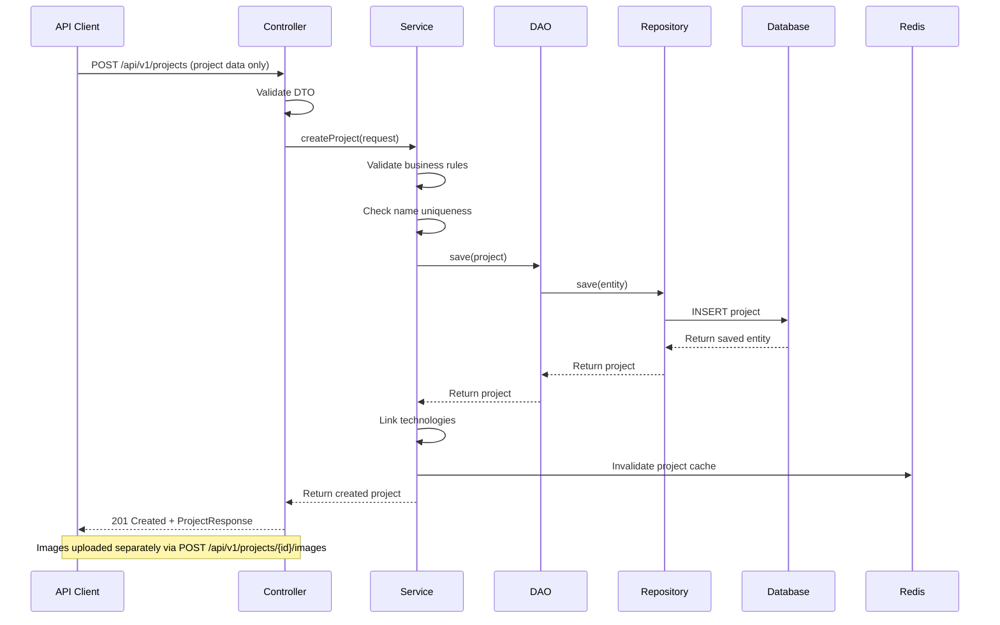
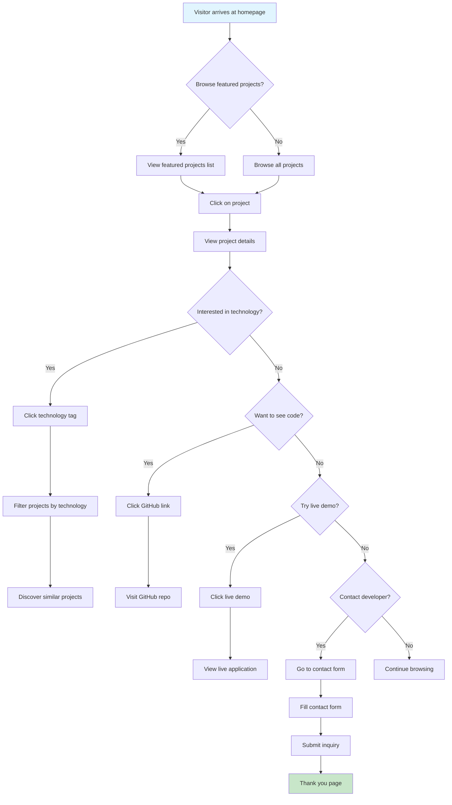
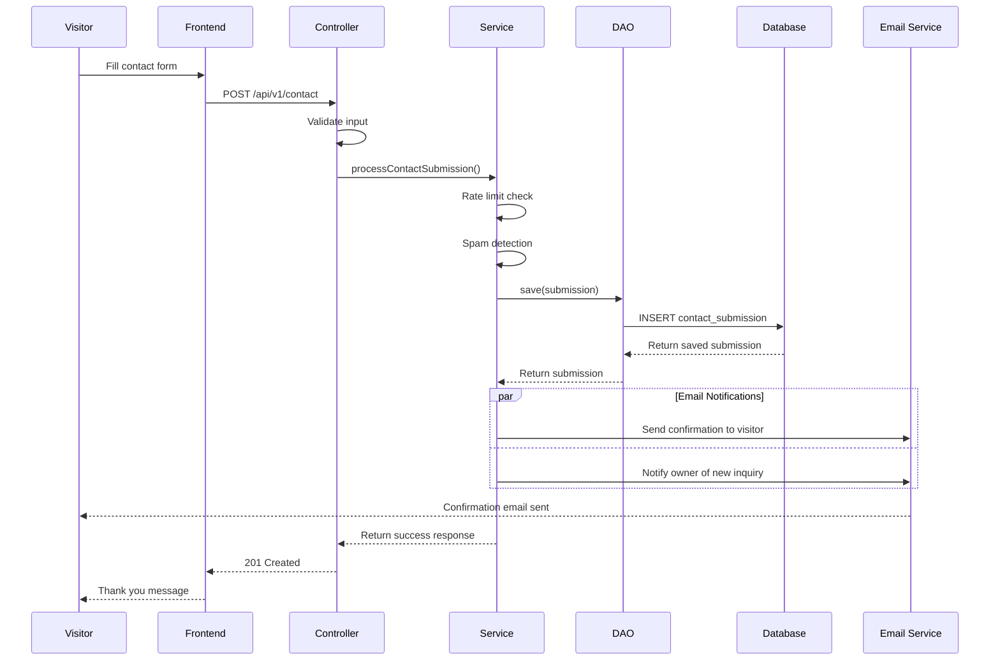
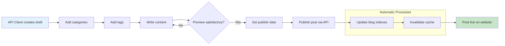
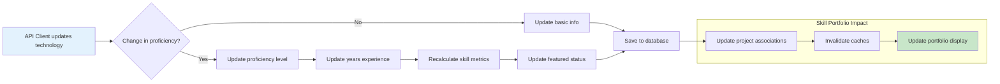
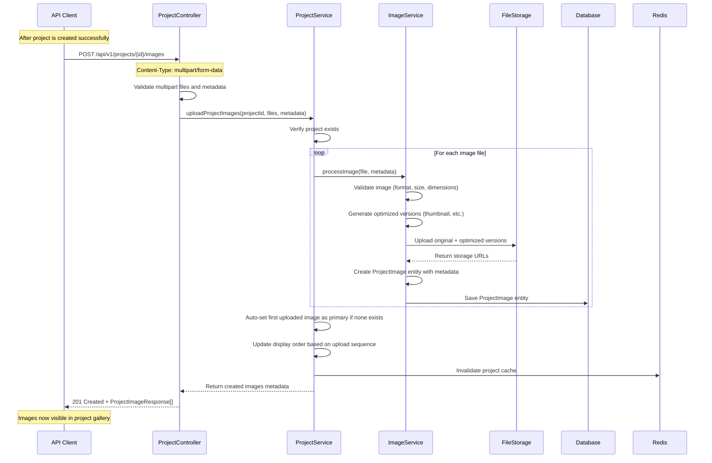
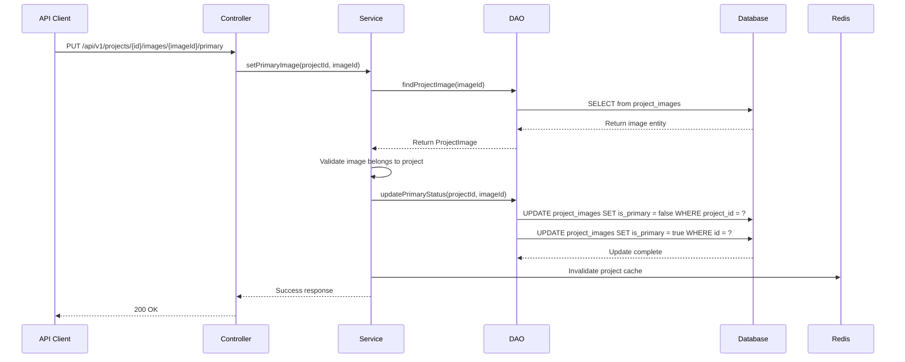
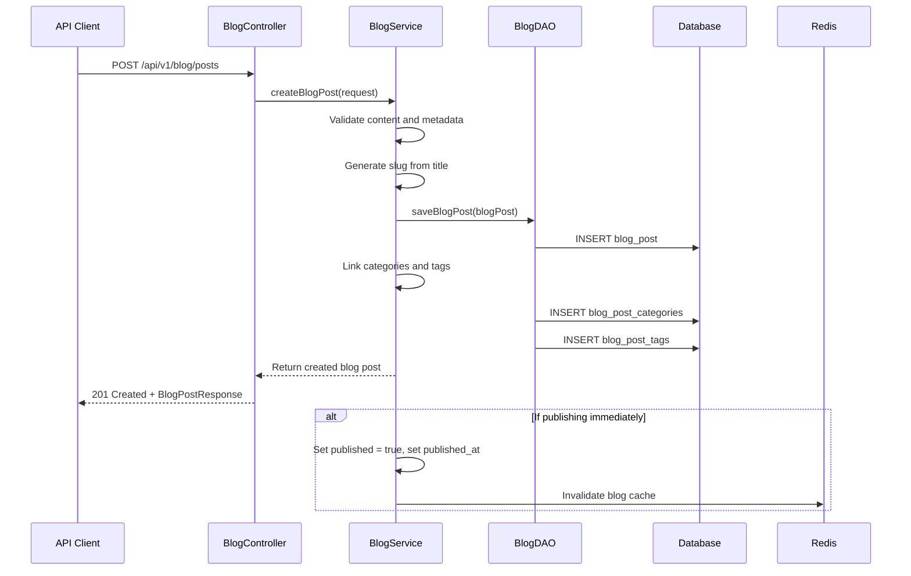
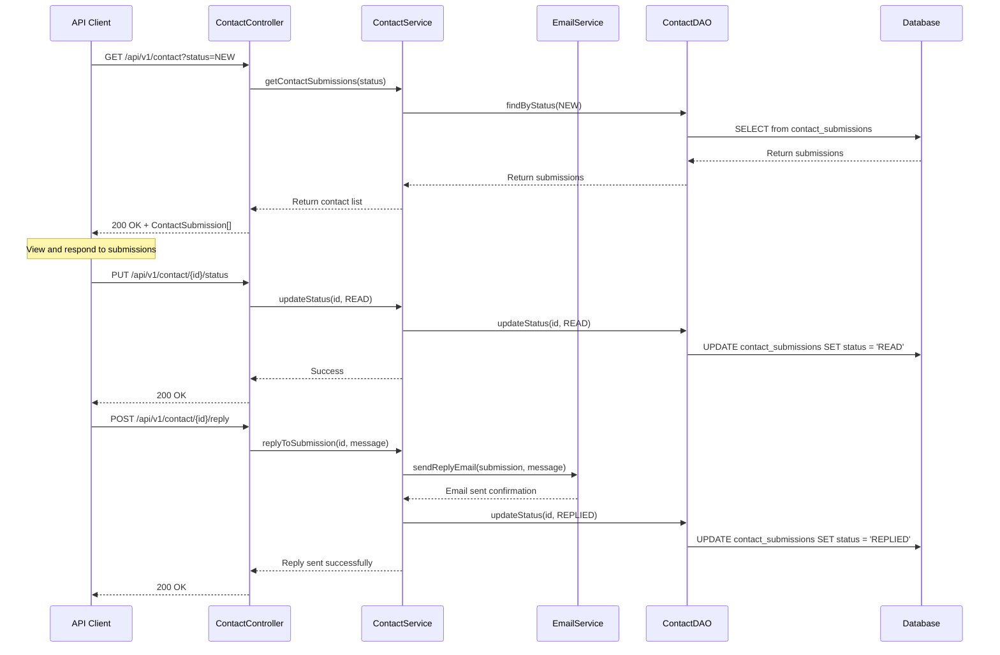

# API Flow Diagrams & User Journeys

## Mermaid Diagrams for System Flows

Copy these diagrams into any Mermaid-compatible tool (GitHub, Notion, etc.) or use the Mermaid Live Editor.

### 1. Project Creation Flow



### 2. Portfolio Visitor Journey



### 3. Contact Form Submission Flow



### 4. Blog Post Publishing Flow



### 5. Technology Proficiency Tracking



## User Journey Maps

### Journey 1: Technical Recruiter
```
Goal: Evaluate technical skills for Java position

Persona: Senior Technical Recruiter
Duration: 15-20 minutes
Device: Desktop (work computer)

Journey Steps:
1. Discovery (LinkedIn/Google) → Land on homepage
2. Visual Overview → Browse project thumbnails for quick assessment
3. Skills Assessment → Filter projects by "Java", "Spring Boot"
4. Project Deep-dive → Click project → View screenshots/demos
5. Code Quality Review → Click GitHub links, review commits
6. Architecture Understanding → View architecture diagrams
7. Communication Skills → Read blog posts about technical topics
8. Contact Decision → Submit hiring inquiry via contact form

Pain Points:
- Need quick skill verification
- Want to see actual project interfaces, not just descriptions
- Looking for recent activity and continuous learning

Solutions:
- Featured technologies on homepage
- High-quality project thumbnails in grid view
- Technology filtering on projects
- Screenshot galleries showing UI/UX work
- Architecture diagrams for technical depth
- Direct GitHub links
- Recent blog posts showing current knowledge
```

### Journey 2: Potential Client
```
Goal: Hire for freelance project development

Persona: Startup Founder
Duration: 10-15 minutes
Device: Mobile (evening browsing)

Journey Steps:
1. Referral → From networking contact
2. Portfolio Review → Browse recent projects
3. Capability Check → Look for similar project types
4. Budget Estimation → Check project complexity and timelines
5. Initial Contact → Submit freelance inquiry

Pain Points:
- Mobile-first browsing experience
- Need to understand project scope and timelines
- Want to see client work examples

Solutions:
- Mobile-responsive design
- Project difficulty and timeline indicators
- Professional vs personal project categorization
- Clear contact form with inquiry type selection
```

### Journey 3: Peer Developer
```
Goal: Learn about interesting technical approaches

Persona: Mid-level Developer
Duration: 25-30 minutes
Device: Desktop (personal learning time)

Journey Steps:
1. Content Discovery → Find blog post via search/social
2. Technical Deep-dive → Read implementation details
3. Related Content → Browse similar projects and posts
4. Code Exploration → Visit GitHub repos for examples
5. Knowledge Sharing → Share interesting findings

Pain Points:
- Want detailed technical explanations
- Need working code examples
- Looking for learning resources

Solutions:
- Detailed blog posts with code examples
- Architecture diagrams and explanations
- Related content recommendations via shared tags
```

### 6. Project Image Upload Flow (Separate Endpoint)



### 7. Primary Image Management Flow



### 8. Blog Post Creation Flow (via API)



### 9. Contact Submission Management Flow (via API)



This comprehensive documentation provides the foundation for understanding system behavior, data flows, and user interactions. Use these diagrams to guide implementation decisions.
