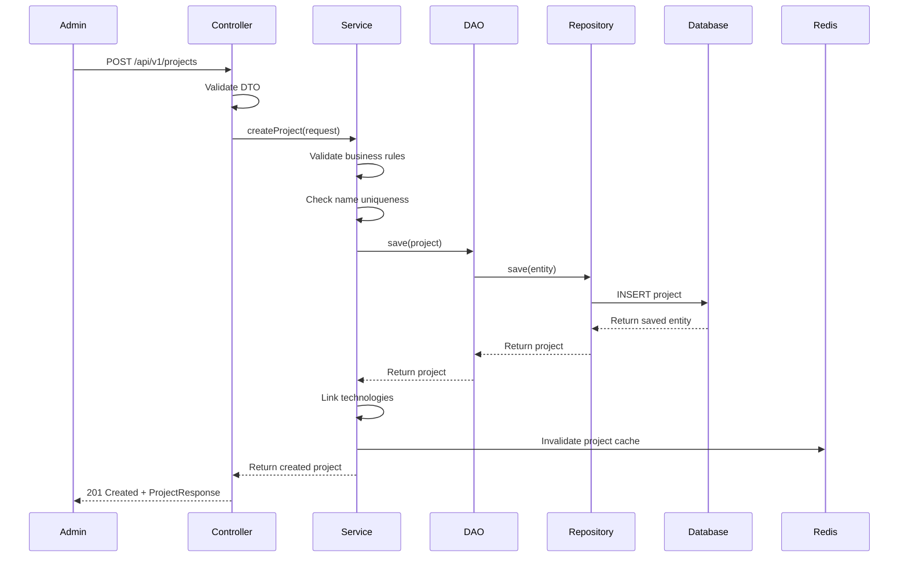
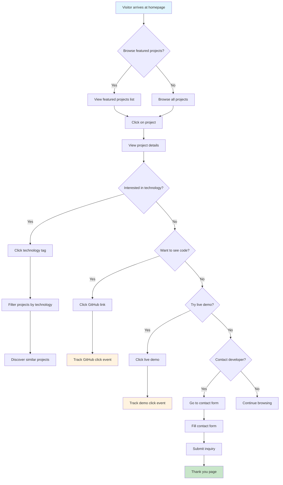
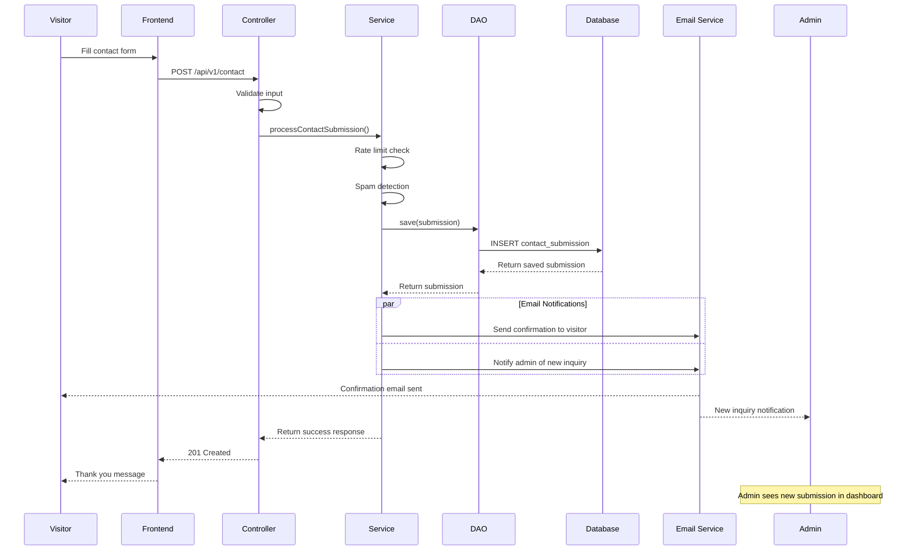
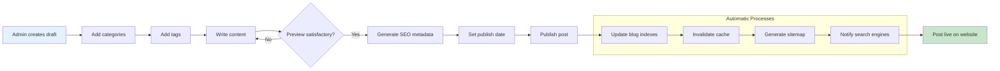
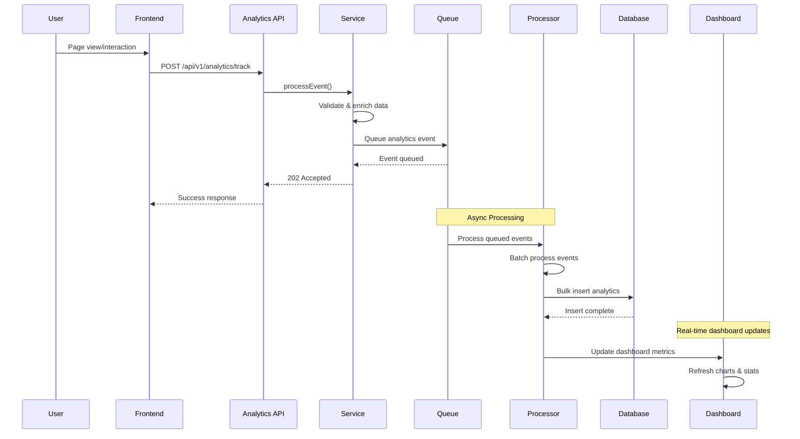
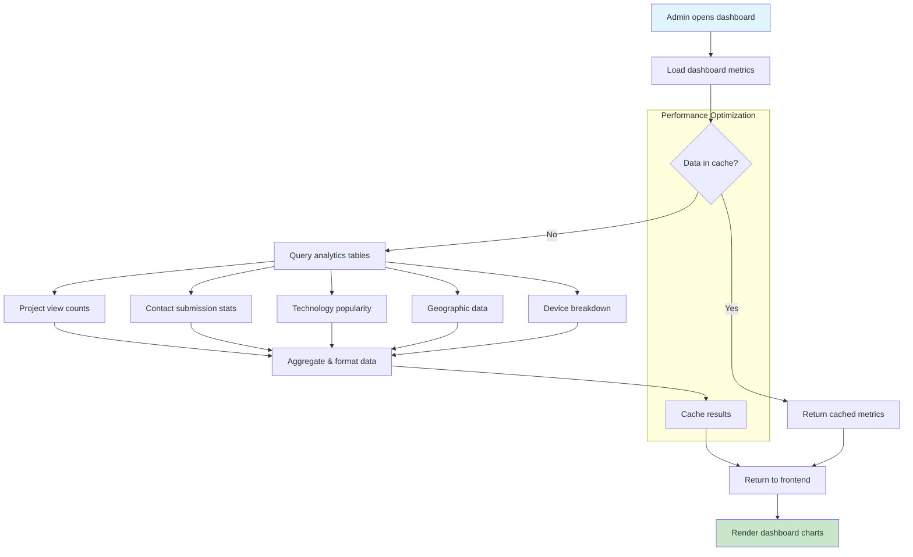
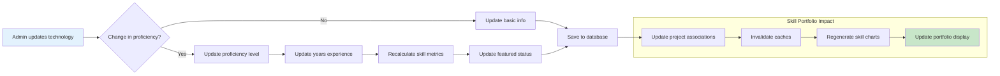
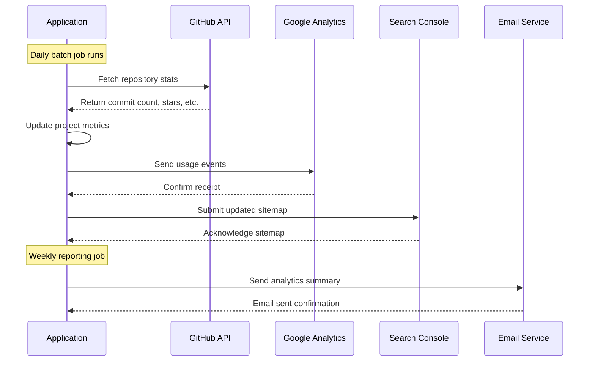

# API Flow Diagrams & User Journeys

## Mermaid Diagrams for System Flows

Copy these diagrams into any Mermaid-compatible tool (GitHub, Notion, etc.) or use the Mermaid Live Editor.

### 1. Project Creation Flow



### 2. Portfolio Visitor Journey



### 3. Contact Form Submission Flow



### 4. Blog Post Publishing Flow



### 5. Analytics Data Collection Flow



### 6. Admin Dashboard Data Aggregation



### 7. Technology Proficiency Tracking



## User Journey Maps

### Journey 1: Technical Recruiter
```
🎯 Goal: Evaluate technical skills for Java position

👤 Persona: Senior Technical Recruiter
🕐 Duration: 15-20 minutes
📱 Device: Desktop (work computer)

Journey Steps:
1. **Discovery** (LinkedIn/Google) → Land on homepage
2. **Skills Assessment** → Filter projects by "Java", "Spring Boot"
3. **Code Quality Review** → Click GitHub links, review commits
4. **Project Depth** → Read project descriptions, check complexity
5. **Communication Skills** → Read blog posts about technical topics
6. **Contact Decision** → Submit hiring inquiry via contact form

Pain Points:
- Need quick skill verification
- Want to see code quality, not just descriptions
- Looking for recent activity and continuous learning

Solutions:
- Featured technologies on homepage
- Technology filtering on projects
- Direct GitHub links with contribution stats
- Recent blog posts showing current knowledge
```

### Journey 2: Potential Client
```
🎯 Goal: Hire for freelance project development

👤 Persona: Startup Founder
🕐 Duration: 10-15 minutes  
📱 Device: Mobile (evening browsing)

Journey Steps:
1. **Referral** → From networking contact
2. **Portfolio Review** → Browse recent projects
3. **Capability Check** → Look for similar project types
4. **Budget Estimation** → Check project complexity and timelines
5. **Initial Contact** → Submit freelance inquiry

Pain Points:
- Mobile-first browsing experience
- Need to understand project scope and timelines
- Want to see client work examples

Solutions:
- Mobile-responsive design
- Project difficulty and timeline indicators
- Professional vs personal project categorization
- Clear contact form with project type selection
```

### Journey 3: Peer Developer
```
🎯 Goal: Learn about interesting technical approaches

👤 Persona: Mid-level Developer
🕐 Duration: 25-30 minutes
📱 Device: Desktop (personal learning time)

Journey Steps:
1. **Content Discovery** → Find blog post via search/social
2. **Technical Deep-dive** → Read implementation details
3. **Related Content** → Browse similar projects and posts
4. **Code Exploration** → Visit GitHub repos for examples
5. **Knowledge Sharing** → Share interesting findings
6. **Future Reference** → Bookmark for later reference

Pain Points:
- Want detailed technical explanations
- Need working code examples
- Looking for learning resources

Solutions:
- Detailed blog posts with code examples
- Learning outcomes documented per project
- Architecture diagrams and explanations
- Related content recommendations
```

## API Integration Patterns

### External Service Integration Flow


This comprehensive documentation provides the foundation for understanding system behavior, data flows, and user interactions. Use these diagrams to guide implementation decisions and communicate system design to stakeholders.