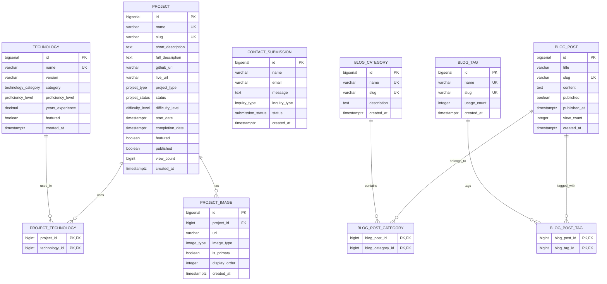

# System Architecture Diagrams

This file contains all Mermaid diagrams for the Personal Website Portfolio system. These will render automatically in GitHub.

## 1. Project Creation Flow

## 2. Portfolio Visitor User Journey

## 3. Contact Form Submission Flow

## 4. System Architecture Overview

## 5. Blog Post Publishing Workflow

## 6. Database Entity Relationships

## 7. Resume Download Flow

## 8. ProjectImage Upload and Management Flow

## 9. Primary Image Management Flow

## 10. Technology Proficiency Tracking

---

**Note**: These diagrams will render automatically when viewing this file in GitHub, GitLab, or any Mermaid-compatible viewer.
