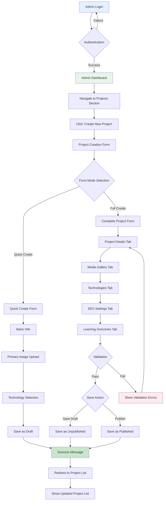
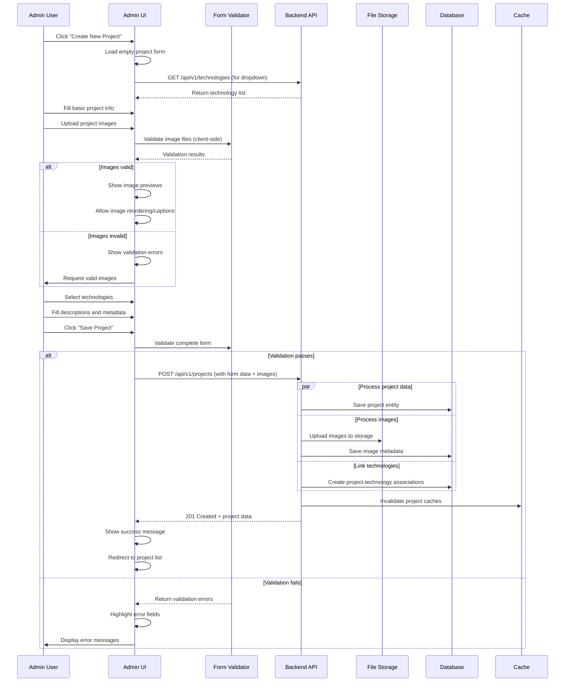
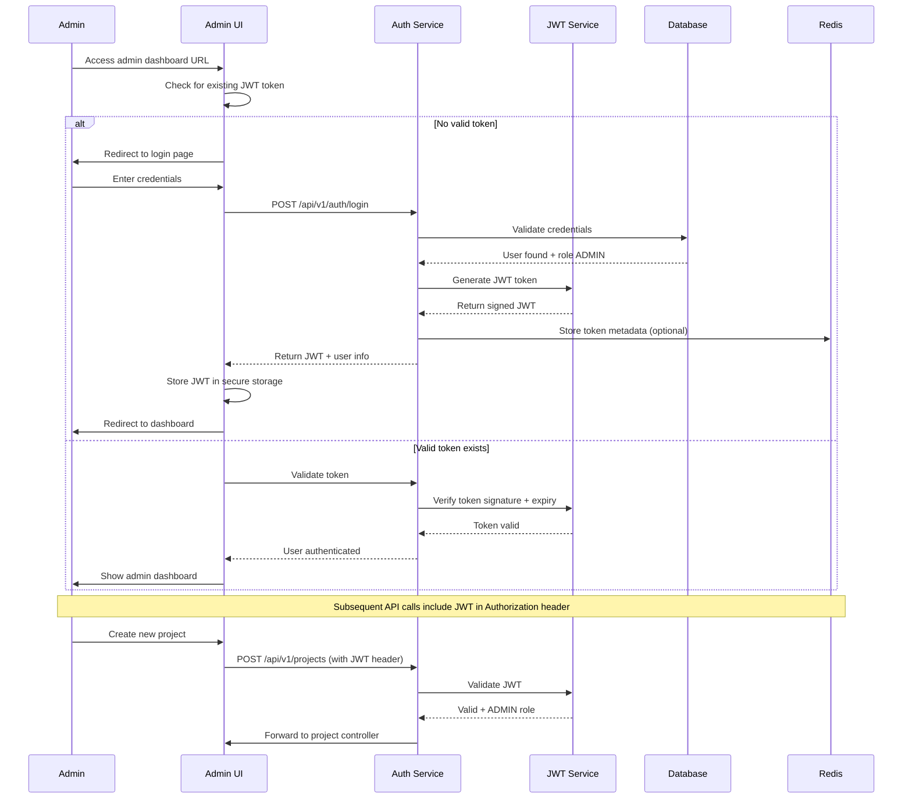
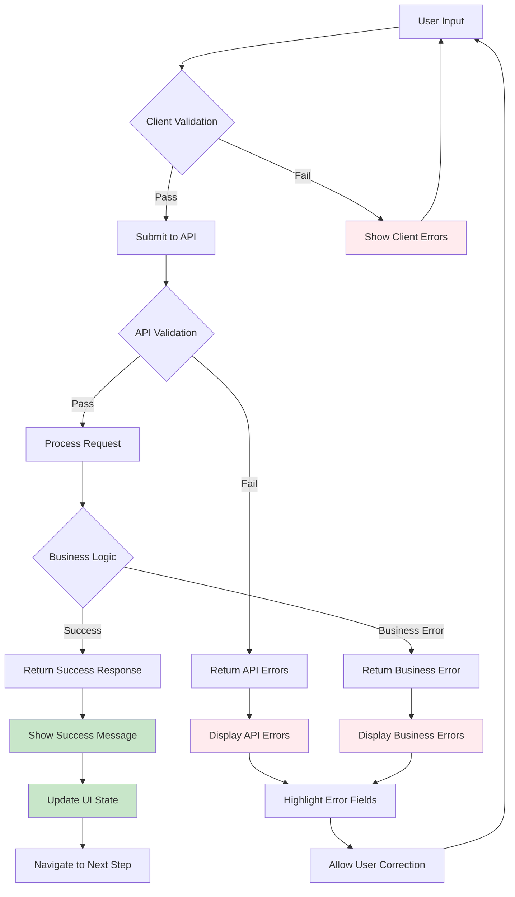

# Admin UI Flow Documentation

## Admin Dashboard User Interface Flows

### Admin Project Creation Flow - Complete UI Journey



### Admin Project Creation Form - Detailed UI Components



### Admin Project Management Dashboard Layout

```
┌─────────────────────────────────────────────────────────────────────────┐
│ Admin Dashboard - Projects Section                                      │
├─────────────────────────────────────────────────────────────────────────┤
│ ┌─────────────────┐ ┌─────────────────┐ ┌─────────────────┐ ┌─────────┐ │
│ │   Dashboard     │ │    Projects     │ │      Blog       │ │Analytics│ │
│ └─────────────────┘ └─────────────────┘ └─────────────────┘ └─────────┘ │
├─────────────────────────────────────────────────────────────────────────┤
│ Projects Overview                                                       │
│ ┌─────────────────┐ ┌─────────────────┐ ┌─────────────────┐            │
│ │ Total Projects  │ │   Published     │ │     Drafts      │            │
│ │       12        │ │        8        │ │        4        │            │
│ └─────────────────┘ └─────────────────┘ └─────────────────┘            │
├─────────────────────────────────────────────────────────────────────────┤
│ ┌─────────────────────────────────────────────────────┐ ┌─────────────┐ │
│ │                 Filter & Search                     │ │ [+ NEW      │ │
│ │ [All Status ▼] [All Types ▼] [Search Projects...  ] │ │  PROJECT]   │ │
│ └─────────────────────────────────────────────────────┘ └─────────────┘ │
├─────────────────────────────────────────────────────────────────────────┤
│ Project List                                                            │
│ ┌─────────────────────────────────────────────────────────────────────┐ │
│ │ ┌─────┐ E-commerce Platform          [Published] [Edit] [•••]      │ │
│ │ │ IMG │ React, Node.js, PostgreSQL   Views: 1,234                  │ │
│ │ └─────┘ Created: Jan 15, 2024       Modified: Jan 20, 2024        │ │
│ ├─────────────────────────────────────────────────────────────────────┤ │
│ │ ┌─────┐ Personal Website Backend     [Draft]     [Edit] [•••]      │ │
│ │ │ IMG │ Spring Boot, PostgreSQL      Views: 0                      │ │
│ │ └─────┘ Created: Jan 10, 2024       Modified: Jan 22, 2024        │ │
│ ├─────────────────────────────────────────────────────────────────────┤ │
│ │ ┌─────┐ AI Chat Application         [Published] [Edit] [•••]      │ │
│ │ │ IMG │ Python, FastAPI, OpenAI      Views: 856                    │ │
│ │ └─────┘ Created: Dec 20, 2023       Modified: Jan 18, 2024        │ │
│ └─────────────────────────────────────────────────────────────────────┘ │
└─────────────────────────────────────────────────────────────────────────┘
```

### Project Creation Form - Tabbed Interface Design

```
┌─────────────────────────────────────────────────────────────────────────┐
│ Create New Project                                          [Save Draft] │
│                                                           [Save & Publish]│
├─────────────────────────────────────────────────────────────────────────┤
│ [Basic Info] [Media Gallery] [Technologies] [SEO] [Learning Outcomes]   │
├─────────────────────────────────────────────────────────────────────────┤
│ Basic Information Tab                                                   │
│                                                                         │
│ Project Name: [________________________________] *Required              │
│ URL Slug:     [e-commerce-platform_____________] (auto-generated)       │
│                                                                         │
│ Short Description (for cards):                                         │
│ [________________________________________________________________]      │
│ [________________________________________________________________]      │
│                                                                         │
│ Full Description (Markdown supported):                                 │
│ ┌─────────────────────────────────────────────────────────────────┐     │
│ │ ## Project Overview                                             │     │
│ │                                                                 │     │
│ │ This e-commerce platform demonstrates full-stack development   │     │
│ │ skills using modern technologies...                            │     │
│ │                                                                 │     │
│ │ ### Key Features                                                │     │
│ │ - User authentication and authorization                        │     │
│ │ - Shopping cart functionality                                  │     │
│ │ - Payment processing with Stripe                               │     │
│ └─────────────────────────────────────────────────────────────────┘     │
│                                                                         │
│ Project Links:                                                         │
│ GitHub URL:       [https://github.com/casey/ecommerce_______]          │
│ Live Demo URL:    [https://ecommerce-demo.vercel.app_______]           │
│ Documentation:    [https://docs.ecommerce.dev______________]           │
│                                                                         │
│ Project Classification:                                                │
│ Type:        [Personal ▼]  Status: [Completed ▼]  Difficulty: [Intermediate ▼] │
│ Start Date:  [01/15/2024]  End Date: [02/20/2024]  Est. Hours: [120]  │
│                                                                         │
│ Display Settings:                                                      │
│ ☑ Featured Project    ☑ Published    Display Order: [1_]              │
│                                                                         │
│                                           [Previous] [Next: Media →]   │
└─────────────────────────────────────────────────────────────────────────┘
```

### Media Gallery Tab Interface

```
┌─────────────────────────────────────────────────────────────────────────┐
│ Create New Project - Media Gallery                      [Save Draft]    │
│                                                       [Save & Publish]  │
├─────────────────────────────────────────────────────────────────────────┤
│ [Basic Info] [Media Gallery] [Technologies] [SEO] [Learning Outcomes]   │
├─────────────────────────────────────────────────────────────────────────┤
│ Project Images                                                          │
│                                                                         │
│ ┌─────────────────────────────────────────────────────────────────────┐ │
│ │ 📁 Drag and drop images here, or click to browse                   │ │
│ │                                                                     │ │
│ │               [Browse Files]                                        │ │
│ │                                                                     │ │
│ │ Supported formats: JPG, PNG, WebP, GIF                             │ │
│ │ Maximum size: 5MB per image                                         │ │
│ │ Maximum images: 20 per project                                      │ │
│ └─────────────────────────────────────────────────────────────────────┘ │
│                                                                         │
│ Uploaded Images:                                                       │
│ ┌─────────────────────────────────────────────────────────────────────┐ │
│ │ ┌─────────┐ ┌─────────┐ ┌─────────┐                                │ │
│ │ │ ⭐ IMG1  │ │   IMG2   │ │   IMG3   │                              │ │
│ │ │ Primary │ │Screenshot│ │Architecture│                            │ │
│ │ │         │ │          │ │ Diagram    │                            │ │
│ │ │ [Edit]  │ │ [Edit]   │ │ [Edit]     │                            │ │
│ │ │ [Delete]│ │ [Delete] │ │ [Delete]   │                            │ │
│ │ └─────────┘ └─────────┘ └─────────┘                                │ │
│ └─────────────────────────────────────────────────────────────────────┘ │
│                                                                         │
│ Image Edit Modal (when [Edit] clicked):                               │
│ ┌─────────────────────────────────────────────────────────────────────┐ │
│ │ Edit Image Details                                         [✕ Close]│ │
│ │                                                                     │ │
│ │ ┌─────────────────┐                                                 │ │
│ │ │                 │  Image Type: [Screenshot ▼]                    │ │
│ │ │  Image Preview  │                                                 │ │
│ │ │                 │  Alt Text: [E-commerce homepage interface]     │ │
│ │ │                 │                                                 │ │
│ │ └─────────────────┘  Caption: [Homepage showing product grid]      │ │
│ │                                                                     │ │
│ │                      Display Order: [1__]                          │ │
│ │                                                                     │ │
│ │                      ☐ Set as Primary Image                        │ │
│ │                                                                     │ │
│ │                               [Cancel] [Save Changes]              │ │
│ └─────────────────────────────────────────────────────────────────────┘ │
│                                                                         │
│                                      [← Previous] [Next: Technologies →] │
└─────────────────────────────────────────────────────────────────────────┘
```

### Admin Authentication Flow



### Error Handling and Validation in Admin UI



### Responsive Admin UI Layout

```
Desktop Layout (1200px+):
┌────────────────────────────────────────────────────────────────────────────┐
│ [Logo] Admin Dashboard                    [Admin Name ▼] [Logout] [Help]   │
├────────────────────────────────────────────────────────────────────────────┤
│ │                        │                                                 │
│ │ ┌────────────────────┐ │ ┌─────────────────────────────────────────────┐ │
│ │ │ Dashboard          │ │ │                                             │ │
│ │ │ Projects           │ │ │            Main Content Area                │ │
│ │ │ Blog Posts         │ │ │                                             │ │
│ │ │ Contact Forms      │ │ │                                             │ │
│ │ │ Analytics          │ │ │                                             │ │
│ │ │ Settings           │ │ │                                             │ │
│ │ └────────────────────┘ │ └─────────────────────────────────────────────┘ │
│ │      Sidebar           │                  Content                       │
│ │     (250px)            │                  (950px)                       │
└────────────────────────────────────────────────────────────────────────────┘

Mobile Layout (< 768px):
┌─────────────────────────────────────┐
│ [☰] Admin Dashboard    [Profile ▼]  │
├─────────────────────────────────────┤
│                                     │
│         Main Content Area           │
│                                     │
│                                     │
│                                     │
│                                     │
│                                     │
└─────────────────────────────────────┘
│ [Dashboard] [Projects] [Blog] [More]│ ← Bottom Navigation
└─────────────────────────────────────┘
```

This comprehensive admin UI documentation provides clear guidance for implementing an intuitive, efficient project management interface that follows modern web application patterns.